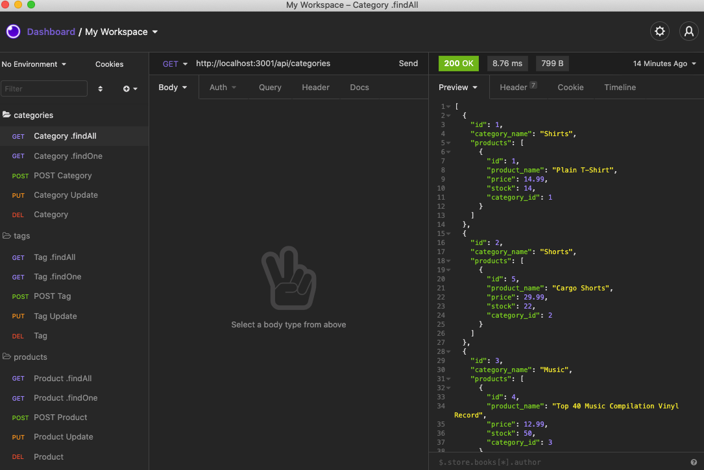

# e-comm-back-end

https://cleanjenn.github.io/e-comm-back-end/

## Mock Up



## Table of Contents 

- [Mock Up](#mock-up)
- [Description](#description)
- [User Story](#user-story)
- [Installation](#installation)
- [Usage](#usage)
- [Contributing](#contributing)
- [Questions](#questions)

## Description 

This code is the back end for an e-commerce site. With a working Express.js API and configureation to use Sequelize to interact with a MySQL database a company can use the latest technologies to compete with other e-commerce companies. 

The full video showing functionality of the appliication can be accesed via this link:
[Video Link](https://drive.google.com/file/d/1W34SDBFpAjeG8huBugkACSwdl4AhnVi6/view?usp=sharing)

## User Story 
```
AS A manager at an internet retail company
I WANT a back end for my e-commerce website that uses the latest technologies
SO THAT my company can compete with other e-commerce companies
```
## Installation 

`npm init`

`npm i dotenv`

`npm i express`

`npm i mysql2`

`npm i sequelize`

- TERMINAL $mysql -u root -p
- TERMINAL $show databases;
- TERMINAL $create database ecommerce_db;
- TERMINAL $quit 
- TERMINAL $npm run seed
- TERMINAL $npm start
- TERMINAL displays "Now Listening"
## Usage
```
Ability to GET, POST, PUT, and DEL a variety of items from Categories, Tags, and Products for e-commerce users. 
```
## Contributions

[Jennifer](https://github.com/cleanjenn)

## Questions 

Feel free to contact me via email: <br /> [Email](mailto:jennifer23gomez7@gmail.com)<br /> 
[Github](https://github.com/cleanjenn)<br />